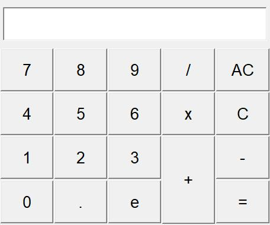
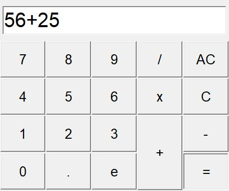
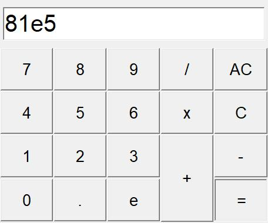
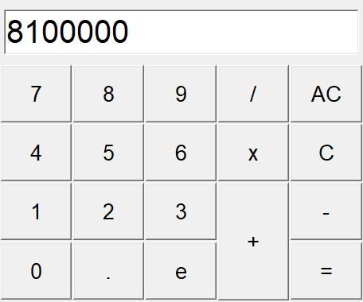

# Simple Calculator using Tkinter

A simple calculator GUI application developed using the Tkinter library in Python. This calculator allows the user to perform basic mathematical operations such as addition, subtraction, multiplication, division, and exponentiation.

## Features

- Addition
- Subtraction
- Multiplication
- Division
- Exponentiation

## Requirements

- Python 3.x
- Tkinter library

## Usage
### Screenshots

-
-
-
-

## Contact

**syedasharali092@gmail.com**

## Support My Projects

https://www.patreon.com/ashar2friends
